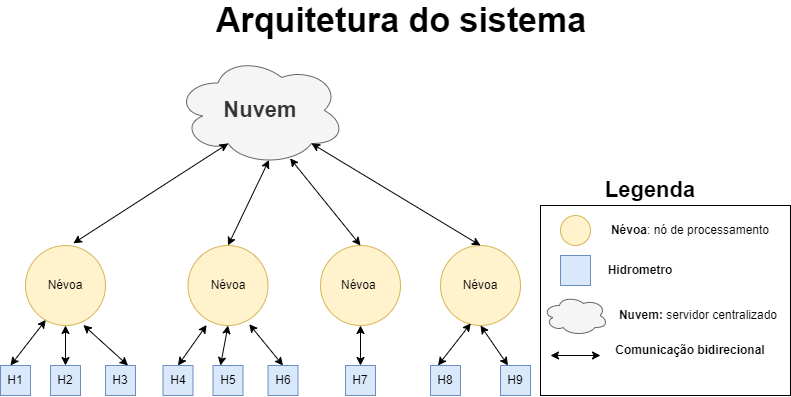
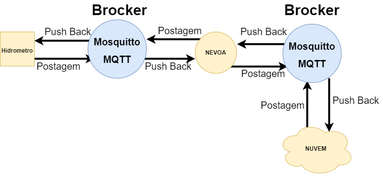

<h1> Consumo de Água Inteligente</h1>

<h2> Alisson Rodrigues¹ ,  João Victor² </h2>
<h2> {alissonrdcsantos, jvitorsantdrade}@gmail.com </h2>

<i><strong> Resumo.</strong>  Este relatório descreve a implementação do sistema de comunicação e controle de uma rede abastecimento de água, o sistema foi desenvolvido em linguagem de programação python utilizando os recursos disponibilizados, paho MQTT para comunicação entre processos, Threads e o framework Flash para construção de uma API Rest, visando atender as requisições de milhões de hidrômetros e acessos de usuários foi empregada uma arquitetura descentralizada usando computação em Nevoa. </i>

<h1>1 Introdução</h1>

 Problemas no abastecimento e distribuição de água são recorrentes no Brasil, distribuidoras são obrigadas a implementar racionamento e políticas de conscientização para os consumidores devido cenários de seca e estiagem nas áreas de reservatórios, desperdício produzido por consumidores e vazamentos nas tubulações, dado um sistema de porte quilométrico e com necessidade de controle em tempo real tem-se um cenário propício para uma solução de internet das coisas(Internet of Things, IoT) informatizando o trabalho do controle de abastecimento e fiscalização do consumo a partir de uma rede de hidrômetros inteligente.

    No problema anterior foi desenvolvido o protótipo do hidrômetro inteligente para o a medição, envio de dados e bloqueio do consumo nas residências dos consumidores junto de uma API Rest como interface da aplicação. Visando atender as necessidades de uma cidade uma nova arquitetura deve ser construída para atender ao envio de dados de milhões de hidrômetros e possibilitar o acesso com menor tempo possível dos dados aos usuários finais que necessitam visualizar os hidrômetros com o maior consumo a fim de traçar a estratégias de controle que beneficiem a todos consumidores.

    Se fez necessário buscar uma nova solução para rede pois, uma solução centralizada seria inviável a atender os requisitos de latência e sobrecarregar um único servidor central, foram exploradas soluções descentralizadas como computação em névoa e computação em borda para construção da solução visando usar métodos aplicados a IOT como por exemplo o messaging protocol for the Internet of Things MQTT a ser aplicado como protocolo de comunicação.

    O restante deste relatório aborda o processo de desenvolvimento da solução do problema e foi organizado da seguinte forma. A seção 2 aborda a fundamentação teórica dos conceitos e tecnologias utilizadas na solução. A seção 3 apresenta a metodologia desenvolvida e os detalhes de implementação junto aos diagramas do sistema proposto. A seção 4 apresenta e discute os resultados obtidos. A seção 5 apresenta as conclusões sobre a solução projetada e conhecimentos adquiridos.

<h1> 2 Fundamentação Téorica</h1>

 Ao produzir a aplicação uma arquitetura adequada deve ser definida, dentre as arquiteturas de aplicação usadas em redes de computadores destacam-se arquitetura cliente-servidor e peer to peer( P2P). Na arquitetura cliente-servidor o hospedeiro servidor está sempre ativo e recebendo as requisições do hospedeiro cliente e enviando a resposta ao cliente, assim a comunicação parte do cliente que faz solicitações somente ao servidor sem interações direta com outros clientes [1].

Uma interface de programação da aplicação( API ) define os protocolos para acesso e utilização dos dados de uma aplicação para serviços fora do sistema [2], uma API rest é uma API que aplica as restrições do modelo Representational State Transfer (REST) , Nestas restrições temos  a  utilização do protocolo HTTP e utilizar formato de dados tipo JASON ou XML.

Na comunicação entre processos os protocolos são empregados a fim de definir as regras e estabelecer a comunicação. O MQTT é um protocolo machine to machine (M2M) aplicado a IoT, o MQTT implementa uma arquitetura cliente-servidor só que voltada ao paradigma Publish-Subcriber. Existe uma entidade chamada brocker que recebe o fluxo de mensagens, organiza publicações por tópicos e repassa aos clientes. Os clientes podem possuir dois papéis o de assinante e de publicador, um assinante inscreve-se em um tópico no e toda vez que uma mensagem chega nesse tópico o brocker passa a mensagem aos clientes inscritos no tópico, um cliente publicador faz postagens nos tópicos para os assinantes.

Como o MQTT é construído sobre TCP/IP ele fornece qualidade de serviço e confiabilidade da chegada das mensagens, são definidos três níveis de qualidade de serviço, q0s( no máximo uma vez ) rápido e com pouco custo, q1s envie até chegar e q2s envie exatamente uma vez.

A computação em nevoa é uma infraestrutura descentralizada de computação em que o processamento é feito de modo mais próximo dos dispositivos finais sem a necessidade de os dados serem passados a nuvem, a eficiência da nevoa está em nós de processamento que possam atender requisições que não necessitam de recursos centralizados e que possam ser distribuídos em nós mais próximos dos dispositivos finais a fim de garantir um melhor tempo de resposta.

<h1>3	Metodologia, Implementação e Testes</h3>

Dentro das especificações devia-se atender a milhões de requisições de hidrômetros e garantir menor latência para o acesso de dados pelos usuários finais através da API, uma solução centralizada foi descartada visto que concentrar todo processamento em um único servidor iria resultar em sobrecarregar o servidor.

<strong>Figura 1. Arquitetura proposta para o sistema</strong>

 

Optou-se por uma arquitetura descentralizada em que o processamento foi distribuído e somente operações que necessitariam de todos dados seriam enviadas em um servidor centralizado. No digrama da arquitetura temos, no primeiro temos os hidrômetros que enviam e recebem dados para a Névoa da sua região( geograficamente definida), no segundo a Névoa realiza o pré-processamento dos dados recebidos e transmite as requisições da Nuvem para os hidrômetros, pôr fim a Nuvem é o processamento centralizado em que são calculadas as médias e listagem de dados par o usuário.

Para o protocolo MQTT foi utilizado o paho-mqtt biblioteca disponível no pyhton junto do Mosquitto brocker. Para aproveitar a futura organização geográfica da cidade onde o sistema será implementado as Nevoas e hidrômetros foram organizados por região e devido a isso optou-se por criar um brocker para cada Nevoa e seus hidrômetros e um único brocker entre a Nuvem e as nevoas.

<strong>Figura 2. Diagrama logico da comunicação MQTT definida.</strong>

Foram definidos os seguintes parâmetros quanto a qualidade de serviço para a comunicação, mensagem de envio de dados recebem q0s já que não existem problemas caso ocorra perde de dados, já as operações como bloqueio e alteração de parâmetros recebem qOs 1 pois tem de ser recebidas para não comprometer o sistema.

A nevoa consistiu dos nós de processamento entre os hidrômetros e a nuvem, foram implementadas para receber o trafego de mensagens dos hidrômetros e realizar as operações de cálculo de média parcial, bloqueio e desbloqueio de hidrômetro e pré registro dos dados dos hidrômetros, quanto a comunicação a nevoa se comunica com o seu brocker e dos seus hidrômetros e com o brocker da nuvem.

Para acesso a aplicação foi criado uma API rest usando o framework Flask no python, a API disponibiliza os métodos para acesso das funcionalidades requisitadas como listar hidrômetros com maior consumo e bloquear um hidrômetro, a nível de implementação uma chamada do tipo Get ou Post é feita o servidor recebe o cabeçalho http e a partir da rota executa a  operação solicitada e se retorna um JSON respondendo a requisição.

